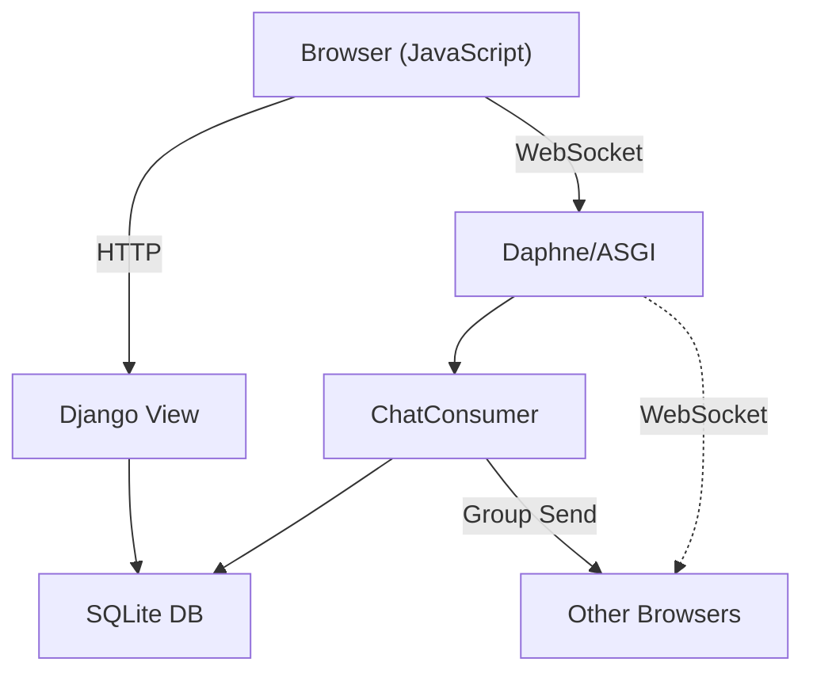

# Django Channels WhatsApp Clone

## 📱 Proje Tanımı

Bu proje, Django ve Django Channels kullanarak gerçek zamanlı mesajlaşma özelliğine sahip bir **WhatsApp benzeri chat uygulaması** oluşturmayı amaçlamaktadır. WebSocket teknolojisi ile anlık mesaj gönderme, alma ve kullanıcı yönetimi gibi işlevler sunmaktadır.

## ✨ Özellikler

- 🔐 **Kullanıcı Kimlik Doğrulama**: Giriş sistemi ile kullanıcı yönetimi
- 💬 **Gerçek Zamanlı Mesajlaşma**: WebSocket kullanarak anlık mesaj alışverişi
- 👥 **Çok Kullanıcılı Chat**: Farklı kullanıcılar arasında private mesajlaşma
- 📝 **Mesaj Geçmişi**: Gönderilen tüm mesajların veritabanında saklanması
- 🕐 **Zaman Damgası**: Her mesajın saati ve saatinin gösterilmesi
- 🎨 **Responsive UI**: Bootstrap ile mobil uyumlu arayüz

## 🔧 Teknoloji Yığını

| Teknoloji | Versiyon | Açıklama |
|-----------|----------|----------|
| **Django** | 4.1.6 | Python web framework'ü |
| **Django Channels** | - | WebSocket ve asynchronous desteği |
| **Daphne** | - | ASGI server |
| **SQLite** | - | Veritabanı |
| **Bootstrap** | 3.3.7 | Frontend framework |
| **JavaScript** | - | Real-time iletişim için |

## 📋 Ön Gereksinimler

- Python 3.8 veya üzeri
- pip (Python paket yöneticisi)
- Git

## 🚀 Kurulum Adımları

### 1. Depoyu Klonlayın

```bash
git clone https://github.com/huseyintaskinn/Django-Channels-WhatsApp-Clone.git
cd Django-Channels-WhatsApp-Clone-main
```

### 2. Sanal Ortam Oluşturun

```bash
# Windows
python -m venv venv
venv\Scripts\activate

# Linux/Mac
python3 -m venv venv
source venv/bin/activate
```

### 3. Gerekli Paketleri Yükleyin

```bash
pip install -r requirements.txt
```

Temel paketler:
- Django==4.1.6
- django-environ
- channels
- daphne

### 4. Ortam Değişkenlerini Ayarlayın

`.env.example` dosyasını `.env` olarak kopyalayın:

```bash
cp django_chat\.env.example django_chat\.env
```

`.env` dosyasını düzenleyin ve gerekli değerleri ayarlayın:

```env
SECRET_KEY=your-secret-key-here
DEBUG=True
ALLOWED_HOSTS=['localhost', '127.0.0.1']
```

### 5. Veritabanı Migrasyonlarını Uygulayın

```bash
python manage.py migrate
```

### 6. Admin Kullanıcısı Oluşturun (Opsiyonel)

```bash
python manage.py createsuperuser
```

### 7. Statik Dosyaları Toplayın (Production için)

```bash
python manage.py collectstatic
```

## 🏃 Projeyi Çalıştırma

### Geliştirme Modu

```bash
python manage.py runserver
```

Uygulama şu adreste açılacaktır: **http://127.0.0.1:8000**

### Daphne ile WebSocket Sunucusu

```bash
daphne -b 127.0.0.1 -p 8000 django_chat.asgi:application
```

## 📂 Proje Yapısı

```
Django-Channels-WhatsApp-Clone-main/
│
├── manage.py                           # Django yönetim komutları
│
├── django_chat/                        # Ana Django projesi konfigürasyonu
│   ├── __init__.py
│   ├── settings.py                     # Proje ayarları (Veritabanı, uygulamalar, vb.)
│   ├── urls.py                         # Ana URL yönlendirmesi
│   ├── wsgi.py                         # WSGI uygulaması
│   ├── asgi.py                         # ASGI konfigürasyonu (WebSocket için)
│   └── .env.example                    # Ortam değişkenleri şablonu
│
├── chat/                               # Chat uygulaması
│   ├── __init__.py
│   ├── models.py                       # Veritabanı modelleri
│   ├── views.py                        # İstek işleyen fonksiyonlar
│   ├── consumers.py                    # WebSocket işlemcileri
│   ├── routing.py                      # WebSocket URL yönlendirmesi
│   ├── urls.py                         # Chat uygulaması URL'leri
│   ├── admin.py                        # Admin paneli yapılandırması
│   ├── apps.py                         # Uygulama konfigürasyonu
│   ├── tests.py                        # Test dosyaları
│   │
│   └── migrations/                     # Veritabanı migrasyon dosyaları
│       ├── __init__.py
│       ├── 0001_initial.py            # İlk migrasyon
│       ├── 0002_alter_message_created_date.py
│       └── 0003_message_what_is_it.py
│
├── templates/                          # HTML şablonları
│   └── chat/
│       ├── index.html                  # Ana sayfa (chat listesi)
│       ├── login.html                  # Giriş sayfası
│       ├── room.html                   # Chat odası (eski versiyon)
│       └── room_v2.html                # Chat odası (yeni versiyon - kullanımdaki)
│
├── static/                             # Statik dosyalar
│   ├── css/
│   │   └── style.css                   # Özel CSS stilleri
│   └── js/
│       └── app.js                      # Frontend JavaScript kodu
│
├── db.sqlite3                          # SQLite veritabanı dosyası (lokal)
│
├── .gitignore                          # Git tarafından yok sayılacak dosyalar
├── .gitattributes                      # Git konfigürasyonu
│
└── README.md                           # Bu dosya
```

## 🗄️ Veritabanı Modelleri

### 1. **Room (Oda)**
Kullanıcılar arasındaki sohbet odalarını temsil eder.

```python
class Room(models.Model):
    id = models.UUIDField(primary_key=True, default=uuid.uuid4)
```

| Alan | Tip | Açıklama |
|------|-----|----------|
| `id` | UUID | Benzersiz oda kimliği |

---

### 2. **ChatUser (Chat Kullanıcısı)**
Hangi kullanıcıların hangi odalara katıldığını izler.

```python
class ChatUser(models.Model):
    user = models.ForeignKey(User, on_delete=models.CASCADE)
    room = models.ForeignKey(Room, on_delete=models.CASCADE)
```

| Alan | Tip | Açıklama |
|------|-----|----------|
| `user` | Foreign Key | Django kullanıcısı |
| `room` | Foreign Key | Oda referansı |

---

### 3. **Message (Mesaj)**
Gönderilen mesajları saklar.

```python
class Message(models.Model):
    user = models.ForeignKey(User, on_delete=models.CASCADE)
    room = models.ForeignKey(Room, on_delete=models.CASCADE)
    content = models.TextField()
    created_date = models.DateTimeField(auto_now_add=True)
    what_is_it = models.CharField(max_length=50, null=True)
```

| Alan | Tip | Açıklama |
|------|-----|----------|
| `user` | Foreign Key | Mesajı gönderen kullanıcı |
| `room` | Foreign Key | Mesajın gönderildiği oda |
| `content` | TextField | Mesaj içeriği |
| `created_date` | DateTime | Mesaj gönderme zamanı |
| `what_is_it` | CharField | Mesaj tipi (örn: metin, resim) |

---

## 🌐 URL Yönlendirmesi

### Ana Projesi URLs (`django_chat/urls.py`)

| URL | View | Açıklama |
|-----|------|----------|
| `/` | `login` | Giriş sayfası |
| `/admin/` | Admin | Django admin paneli |
| `/chat/` | `index` | Chat ana sayfası |

### Chat Uygulaması URLs (`chat/urls.py`)

| URL | View | Açıklama |
|-----|------|----------|
| `/chat/` | `index` | Tüm sohbetler listesi |
| `/chat/<room_name>/` | `room` | Belirli bir sohbet odası |
| `/chat/start-chat/<room_id>/` | `startChat` | Yeni sohbet başlatma |

### WebSocket URLs (`chat/routing.py`)

| WebSocket Adresi | Consumer | Açıklama |
|------------------|----------|----------|
| `ws/chat/<room_name>/` | `ChatConsumer` | Sohbet WebSocket bağlantısı |

---

## 📝 Ana Dosyaların Açıklaması

### 1. **models.py**
- Veritabanı şemasını tanımlar
- `Room`, `ChatUser`, `Message` modellerini içerir
- `get_short_date()` metodu mesaj saatini formatlar

### 2. **consumers.py**
- WebSocket bağlantılarını yönetir
- `ChatConsumer` sınıfı:
  - `connect()`: Yeni WebSocket bağlantısını kabul et
  - `disconnect()`: Bağlantıyı kapat
  - `receive()`: WebSocket'ten mesaj al
  - `chat_message()`: Mesajı grup üyelerine gönder
  - `save_to_database()`: Mesajı veritabanına kaydet

### 3. **views.py**
- HTTP isteklarini işler
- `index()`: Kullanıcının tüm sohbetlerini göster
- `startChat()`: Belirli bir sohbeti başlat
- `room()`: Sohbet odasını render et
- `login()`: Kullanıcı giriş işlemi

### 4. **routing.py**
- WebSocket URL'lerini tanımlar
- `ChatConsumer` ile `ws/chat/<room_name>/` bağlantısını kurar

### 5. **asgi.py**
- ASGI uygulamasını yapılandırır
- HTTP ve WebSocket protokollerini destekler
- Channels middleware'ini ayarlar

### 6. **settings.py**
- Django proje ayarları
- `daphne`, `channels` uygulamalarını etkinleştirir
- SQLite veritabanını yapılandırır
- `ASGI_APPLICATION` ile Channels'ı entegre eder

---

## 💻 Kullanım Örneği

### 1. Giriş Yapma
- Ana sayfaya gidin: `http://127.0.0.1:8000`
- Geçerli kullanıcı adı ve şifrenizi girin
- "Giriş" butonuna tıklayın

### 2. Sohbet Başlatma
- Giriş yaptıktan sonra, mevcut sohbetlerin listesi gösterilir
- Bir sohbete tıklayarak sohbet odasını açın
- Mesaj yazın ve göndeyin

### 3. Gerçek Zamanlı İletişim
- WebSocket aracılığıyla mesajlar anında gönderilir
- Mesaj geçmişi veritabanından yüklenir
- Her mesajın gönderme zamanı gösterilir

---

## ⚙️ Ortam Değişkenleri

`.env` dosyasında aşağıdaki değişkenleri ayarlayın:

```env
SECRET_KEY=your-django-secret-key            # Django gizli anahtarı
DEBUG=True                                   # Hata ayıklama modu (production'da False)
ALLOWED_HOSTS=['localhost', '127.0.0.1']    # İzin verilen hostlar
```

---

## 🗄️ Veritabanı

- **Tip**: SQLite
- **Dosya**: `db.sqlite3`
- **Yer**: Proje kök dizini

### Veritabanı Sıfırlama

```bash
# Tüm migrasyonları geri al (production'da kullanmayın!)
python manage.py migrate chat zero

# Migrasyonları tekrar uygula
python manage.py migrate
```

---

## 🔒 Güvenlik Notları

1. **SECRET_KEY**: Production ortamında güçlü bir gizli anahtar kullanın
2. **DEBUG**: Production'da `DEBUG=False` ayarlayın
3. **ALLOWED_HOSTS**: Production'da doğru host adreslerini ayarlayın
4. **WebSocket**: HTTPS/WSS kullanarak şifrelenmiş iletişim sağlayın
5. **Veritabanı**: Production'da PostgreSQL gibi daha güçlü bir veritabanı kullanın

---

## 🐛 Olası Sorunlar ve Çözümleri

### Sorun 1: "channels.exceptions.InvalidChannelLayerType"
**Çözüm**: `CHANNEL_LAYERS` ayarını `settings.py`'de kontrol edin. In-memory layer sadece development için uygundur.

### Sorun 2: WebSocket bağlantısı başarısız
**Çözüm**: Daphne server'ın çalıştığını ve WebSocket adresinin doğru olduğunu kontrol edin.

### Sorun 3: "DisallowedHost" hatası
**Çözüm**: `.env` dosyasındaki `ALLOWED_HOSTS` değerini kontrol edin.

### Sorun 4: Mesajlar gönderilmiyor
**Çözüm**: 
- Veritabanı migrasyonlarını çalıştırdığınızdan emin olun
- ChatUser kaydının oluşturulduğunu kontrol edin
- Browser console'unda WebSocket hatasını kontrol edin

---

## 📚 Yapı Özeti



---

## 🚀 Production Dağıtımı

### Önerilen Yapılandırma

1. **Veritabanı**: PostgreSQL
2. **Web Server**: Nginx
3. **ASGI Server**: Daphne + Uvicorn
4. **Cache/Channel Layer**: Redis
5. **SSL**: Let's Encrypt

### Redis Kurulumu (Channel Layer için)

```python
# settings.py
CHANNEL_LAYERS = {
    "default": {
        "BACKEND": "channels_redis.core.RedisChannelLayer",
        "CONFIG": {
            "hosts": [("127.0.0.1", 6379)],
        },
    },
}
```


**Django Sürümü**: 4.1.6  
**Python Sürümü**: 3.8+

---

## 📹 Proje Demosu

https://github.com/user-attachments/assets/33fd7fff-3fba-4b4b-9e45-8efbf2911dad

---
